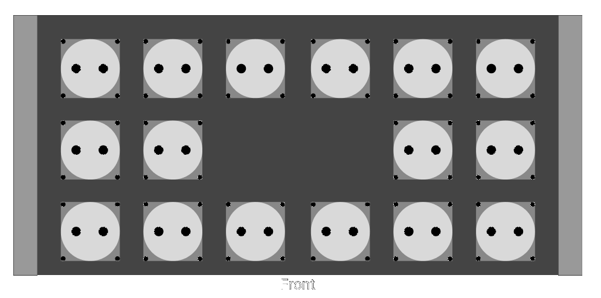
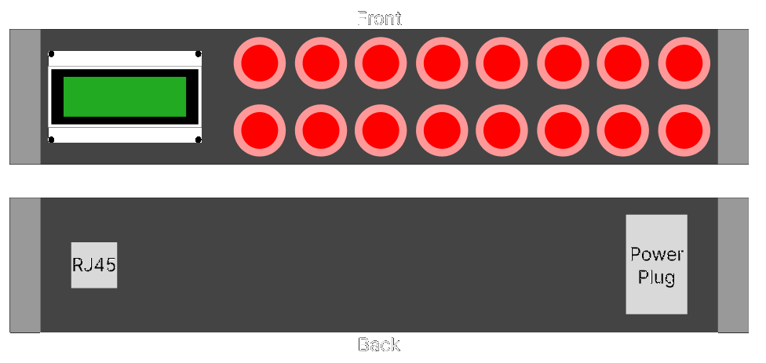

> I, Mircea Anton, will participate in the next Devember. My Devember project will be “PiPDU”. I promise I will program for my Devember for at least an hour, every day of the next December. I will also write a ~~daily~~ weekly public devlog and will make the produced code publicly available on the internet. No matter what, I will keep my promise.

## What is a piPDU

If the name is not suggestive enough, piPDU is a smart PDU, powered by Raspberry Pi and Arduino. I intend to build it and mount it in my Home Lab rack, all by the end of December (hopefully before Christmas, but we'll see about that 😅).

## Why am I building this

I was inspired by projects such as the TinyPilot and the PiKVM and I want to contribute to the community. To do so, I decided to build a project in that same style: an enterprise DNA product built with Raspberry Pis.

The problem I am solving with this project is twofold:

1. I want to be able to see the power consumption for each of my servers. To do that, I don't want to use a Kill-a-watt and crawl behind my server rack. I want to display the data on a webpage.
2. I want to be able to turn devices on and off without crawling to the back of the server rack to pull plugs out. I want a webpage that I can visit to toggle individual plugs.

## What are the goals of the project

At the end of this project, I will have 2 boxes that I can mount on my rack. One will be the PDU itself while the other will be a controller.

The reason I am building them as 2 separate components is for mounting flexibility. I want to mount the PDU in the back of the rack, somewhere in the middle, height-wise. The controller I will mount in the topmost slot, in the front of the rack, for ease of access.

### The PDU

The PDU is a 5U box with 16 Schuko plugs on it. Inside, there will be a Raspberry Pi Zero which will host a small webpage and an API server, and an Arduino to interface with the sensors.

The API server has two main functionalities:

- It provides endpoints to allow me to toggle each plug on and off.
- It exposes the power consumption for each plug, in real-time.

The webpage will be a simple front-end for the functionality exposed by the API.

To get the reading for the consumption of each power plug, there will be 16 current sensors inside. Since I will need a large amount of digital and analog pins, I decided to add an Arduino Mega to the mix.

The Raspberry and Arduino will communicate over a serial connection. The Arduino will send the readings from the current sensors to the Raspberry. The Pi will then expose these readings via the API.  
In the other direction, the Raspberry will send the Arduino commands received via API calls to turn relays on and off.

### The Controller

The controller is a 2U box with 16 buttons, 16 LEDs, and an LCD display on the front plate. The buttons will toggle the outlets on and off, the LEDs will show the status, and the LCD will display stats.

There are 2 possible actions for each button:

- a short press will show the current power consumption for the associated plug on the LCD
- a long press will toggle that socket on/off on the PDU

I chose to use arcade-style buttons for the controller since they have built-in LEDs. Their circular shape makes it easy to drill holes for them in the front plate.  
For the LCD, I picked the 2004 model since I had one lying around.

Inside this box will be another Raspberry Pi Zero and Arduino Uno. The Arduino will connect to the buttons and LEDs as well as the LCD display. The Raspberry will be sending out API requests to the API server hosted on the PDU.

There will be a serial connection between the two. The Raspberry will receive event notifications (button presses) from the Arduino. Based on which button was pressed and for how long, it will send the appropriate API request.  
In the case of a long press, it will query the API for the power consumption of that outlet and send it to the Arduino to display it on the LCD.  
In the case of a short press, it will send an API request to toggle the state of that outlet.

## Conclusion

I am hopefully aiming to achieve all of this by the 24th of December so that I have everything done by Christmas time.

In the first week, I expect to get the hardware part done. I am planning to get both the cases built and the circuits put together.

In the second week, I am planning to finish the PDU box. This involves:

- the Arduino code to read the data from the sensors
- the Arduino code to turn relays on and off
- the flask application for the Raspberry to host the API server
- the code to ensure serial communication between the 2 boards

In the third week, I will finish up the controller component, which involves:

- the Arduino code to interact with the buttons
- the Arduino code to interact with the LCD display
- the python script for the Raspberry to send API requests
- the code to ensure serial communication between the 2 boards

This is a high-level overview of the project I hope to accomplish this month.

---

I hereby challenge you as well to a Devember project! Pick something you've been wanting to work on/tinker with for a while and go at it! Create/Learn something and share it with the community along the way!
